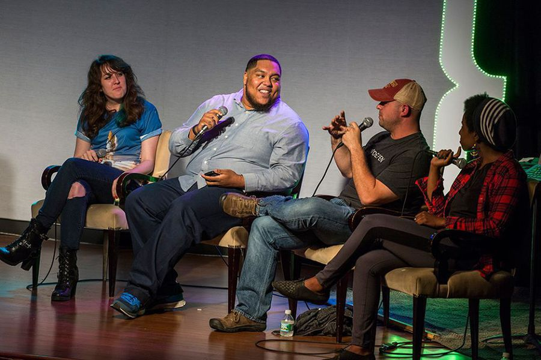
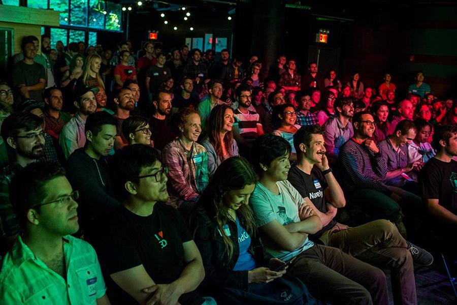
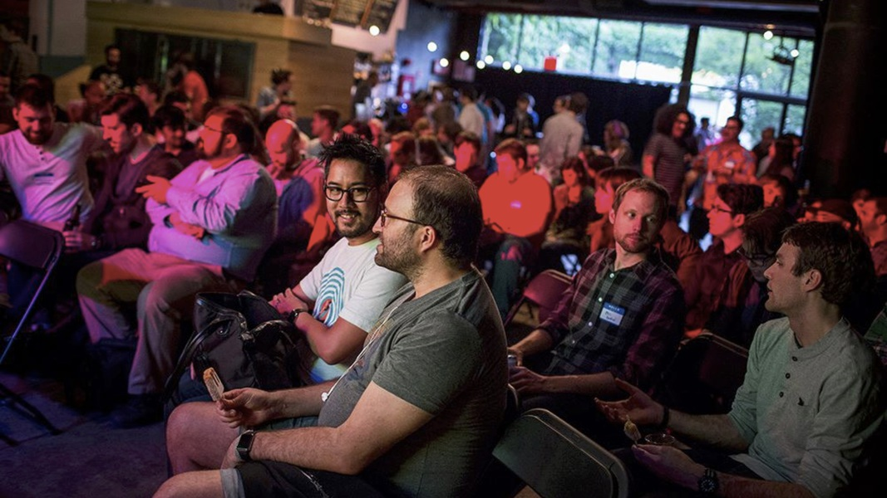
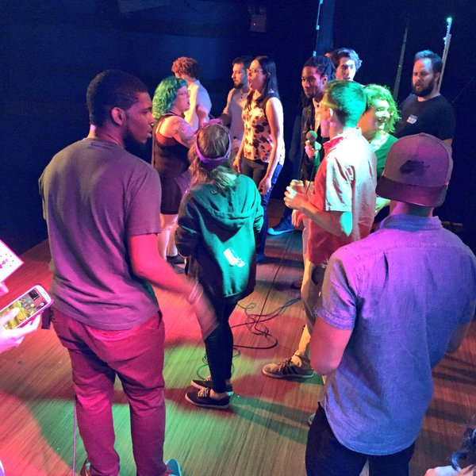
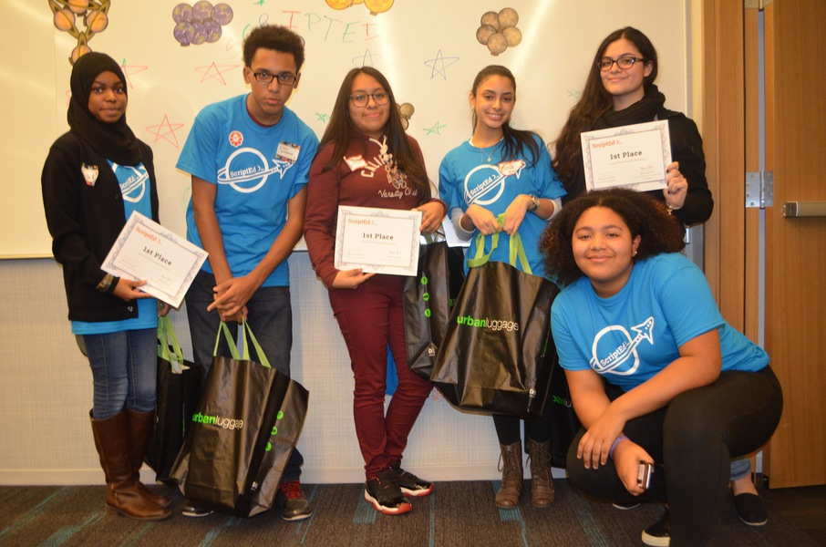
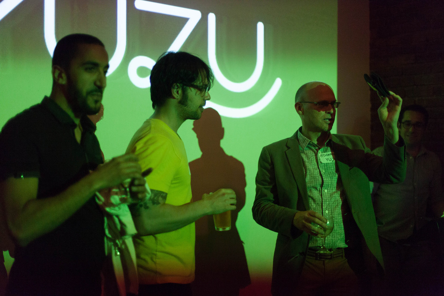
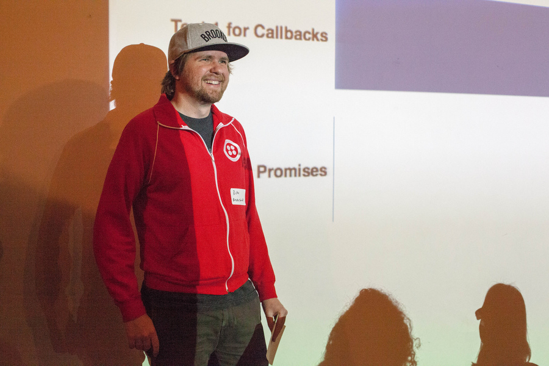
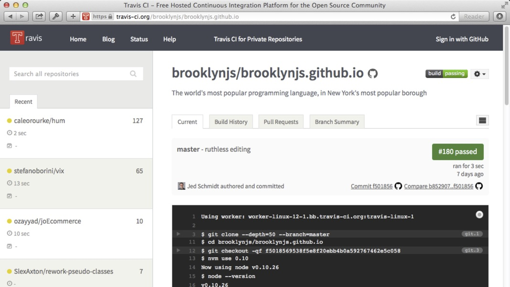
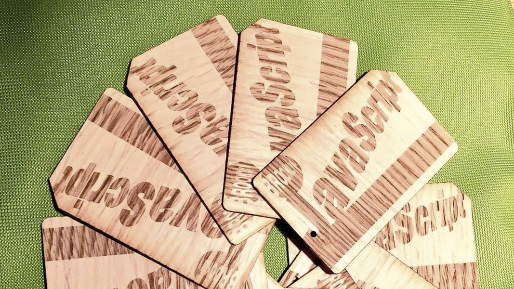

Building BrooklynJS
===================






[BrooklynJS][brooklynjs] is a monthly JavaScript event that takes place in Brooklyn, New York. From its start in November 2013 until this was written in December 2015, BrooklynJS had showcased 102 speakers and 15 musical guests for thousands of attendees, who along with 45 sponsors helped raise over $36,000. It grew alongside a new community of JavaScripters that has become one of the most vibrant in the world.

This is [my][jedschmidt] story of how BrooklynJS came to be.

Prologue
--------


My BrooklynJS story begins in 10 timezones away in Tokyo, where I was living in 2013. My girlfriend's startup had decided to move their product team to New York City, so we packed up our stuff and moved to Brooklyn.

Though I was a bit sad to leave one of my favorite cities in the world, I was also excited to live in a city where I could hobnob with JavaScript heroes; [John Resig][jeresig] in Park Slope, [Jeremy Ashkenas][jashkenas] in Brooklyn Heights, and [Ryan Dahl][ryah] in Williamsburg.

But by the time I arrived, [Brooklyn's JavaScript meetup][bkjs] had come to an end after [its organizer][marcocarag] left the borough (or maybe because they couldn't top a [Brian Leroux][brianleroux] [drinkup][bkjs2013]?), and the [Manhattan equivalent][nycjs], which I had [once attended][nycjs2010] and enjoyed three years prior, had been taken over by a Sencha Touch meetup complete with the ultimate in event code smells, ["webinars"][nycjswebinar].

So aside from a handful of small company-specific events, there wasn't much of a local JavaScript scene in New York. But I knew there was elsewhere; shortly after landing in New York, I started a conference crawl that took me to some amazing events over the summer of 2013:

- [TXJS][txjs], my favorite regional JavaScript conference, run by [noted identity thief][jedjs] [Alex Sexton][slexaxton],
- [JSConf][jsconf], the conference that kicked off the modern JavaScript community as we know it, run by [Chris Williams][voodootikigod],
- [JSConf EU][jsconfeu], JSConf's European cousin, then run by [Malte Ubl][cramforce], [Holger Blank][hblank], [Jan Lehnardt][janl], and [Tiffany Conroy][theophani],
- [RejectJS][rejectjs], JSConf EU's first-born son, run by [Robin Mehner][rmehner], and
- [CSSConf EU][cssconfeu], JSConf EU's little sister, run by [Kristina Schneider][kriesse] and [Michael Pfeiffer][m_p_pfeiffer].

Each one felt a little like two months of summer camp compressed into a weekend, a bunch of edutaining activities interspersed with [jokes][introcss] and [singing][disneyjs]. And when they would end, I'd feel a little sad to return home and leave those distant micro-communities behind. So I decided to find a way to bring the fun back to New York City.

Origin
------


Along my conference travels over the summer, I kept bumping into [Brian J Brennan][brianloveswords], one of Brooklyn's finest humans, who also wanted to bring the feels of a JSConf-type event back home. By 2013, Brian and I had been to a lot of tech events, but only to attend or speak, and not to organize. Since organizing a big conference with the production value of those in the JSConf family seemed like more work than we wanted to take on, we hatched a plan to take the fun of a JSConf event, shrink it down to 8.33333-ish percent of its original size, and spread it across every month of the year. And since Brian and I lived a short walk away from each other, we decided to give our event a local feel and call it _BrooklynJS_. In November of 2013, Brian [registered the domain][icann], and I created [our riff][logo] on Chris William's [JS logo][logojs] and set up [a website][first commit] in the flavor of an [MTA schedule][mta].

Venue
-----


We looked at a few prospective venues, including a bootcamp code school and some startup offices, but settled on the [upstairs room][61upstairs] at [61 Local][61local], a pub in Cobble Hill down the street from my apartment. Though we didn't really know it at the time, choosing 61 Local was one of the best decisions we made. Not only did it help set us apart from the usual tech meetup ambiance of pizza and Coors under fluorescent lights, but it also freed us of the awkwardness of holding an event in a office of a tech company. Companies that host meetups see their role as somewhere between charity, in which venue availability can disappear at the first sign of a hiring freeze or more important event, and opportunism, in which recruiters use their captive audience to foist awkward pitches and boring in-house tech talks.

Having our event in a space unencumbered by the agenda of our host meant that we had more freedom to control the tone and personality of our event, to make it more engaging such as by adding music and comedy. But perhaps more importantly, it also presented a symbiotic relationship in which we bring a diverse crowd of a hundred thirsty developers (as in software, not as in Wall Street, an important distinction in New York City) in exchange for a creative space that we can call our own once a month.

Having a win-win relationship like this was one of the biggest factors in the success of the event. Because our interests were mutually aligned, 61 Local was happy to set aside the space on the same day every month, and would schedule and invoice us accordingly, reducing the busywork of running a meetup in a potentially ephemeral venue. And keeping the event timing predictable in both time (third Thursday of the month) and space (61 Bergen Street) also made it easier for other related events to slot in around us without conflict, and for us to dependably book out-of-town speakers in advance.

More specifically to our setup, 61 Local has been an incredible partner. From [the local CSA][localroots] to [their calendar full of interesting events][61events], you can tell they're wired for community. Get there early enough and you can see laptoppers in the morning give way to parents in the afternoon and then professionals in the evening, enjoying their [rotating roster][drinklocal] of local craft beer, kombucha, and soda.

61 Local's focus on their community has made it easier for us to focus on ours. When their Internet buckled under the load of a hundred nerds, they installed FiOS and a new WiFi endpoint. When their kitchen strained under the load of a hundred mouths, they created a [custom branded menu][61menu] optimized for throughput to keep their kitchen running. So while we often receive complaints that the venue is [too][toosmall1] [small][toosmall2] for the size of the audience we attract, I can't imagine moving. And besides, we'd rather see more events than bigger ones.

Talks
-----


The core of a BrooklynJS event consists of five lightning talks of ten minutes each, preceded by an intro in which the emcees give some context for the event.

```
+-------+ +====+ +====+ +====+ +====+ +====+
| intro | |talk| |talk| |talk| |talk| |talk|
+-------+ +====+ +====+ +====+ +====+ +====+
```

Talk proposals are entirely open, and take place on GitHub via a pull request, starting the day after the previous month's event. To submit a talk, speakers insert their name and talk title into [our website source][indexhtml], and add a description in the body of the pull request. Two weeks before each month's event (and the day before tickets go on sale), we choose five talks from the outstanding pull requests by merging in [our choices][chosentalks] (and dealing with the inevitable merge conflicts).

Using an open format for talk submissions has worked out well. Having more talks than the average meetup would require more grunt work to curate manually, and we're constantly delighted by the high quality of unexpected proposals from new and returning speakers.

Once in a while we'll exercise a little bit of curation and cajole interesting speakers into submitting, so that the lineup is one we think our attendees will enjoy, but [even JavaScript celebrities need to submit a pull request][eichpr]. For first-time speakers uncomfortable with submitting a public pull request, we also offer out-of-band advice and coaching (via Twitter DM, Slack channel, or in-person) before the pull request, so that there's no risk of getting rejected publicly.

Sometimes we'll try to steer people to topics that are likely to be more successful based on our audience. This usually means keeping things from getting too specific, such as talks on tool A (such as testing) for framework B (such as Angular), which would appeal only to a limited section of attendees.

For talks that are not chosen, we give the speaker a code to buy a reserved ticket to the event anyway. This is by far the most reliable way to get often scarce tickets, and is also a cheap and convenient way for us to increase the number of talks from which to choose.

Social
------





Another one of The Good Parts™ of a JSConf event that we wanted to emulate was the "hallway track", where attendees can interact informally outside of scheduled content. So again we took a cue from Chris Williams, and tacked a [beer.js][beerjs] to the end of our event.

```
+-------+ +----+ +----+ +----+ +----+ +----+ +=========+
| intro | |talk| |talk| |talk| |talk| |talk| | beer.js |
+-------+ +----+ +----+ +----+ +----+ +----+ +=========+
```

Our choice of venue made this easy, as talks take place upstairs from the bar, far enough to be out of earshot but still in the same building. With the usual conference room meetup format, presentations and conversation can only happen in serial, which is unfortunate when many attendees [come for the social][nolanbeverajs].

While we had intended only to give folks an opportunity to mingle after the talks, having a less structured mode of interaction came with other benefits. For example, we were able to avoid the inevitable attendee attrition that takes place at meetups in which attendees post-game at a separate venue. Having a social track also makes it easier for us to accommodate folks that had to stay late at work or couldn't get a ticket but still want to hang out.

We did, however, tweak the "beer.js" brand a little bit to make it our own. Specifically, we took out the "beer". Since the use of alcohol at tech events can be a tricky issue, we wanted to avoid naming our hallway track after it. Also, when it comes to Brooklyn, attendees are just as likely to be avoiding gluten as they are alcohol, and with all the great [kombucha][kb] and [soda][soda] the borough offers, we wanted to be more inclusive.

Thankfully, resident pun expert [Willman Duffy][willmanduffy] [came up][willmanbeverajs] with an amazing JavaScript-specific rebrand: **bevera.js**. It's so clever; I hope it catches on elsewhere.

```
+-------+ +----+ +----+ +----+ +----+ +----+ +===========+
| intro | |talk| |talk| |talk| |talk| |talk| | bevera.js |
+-------+ +----+ +----+ +----+ +----+ +----+ +===========+
```

Music
-----


As any good web developer knows, the best way to keep users engaged is to minimize the time they spend waiting. The same is true of meetups, and critically so for ones with multiple talks straddled by minutes of the awkward dance of getting arbitrary slideshow software on arbitrary laptops to work with the venue's projector setup. In our case, a few minutes of downtime in each of six gaps between blocks could add up around 20 minutes, or two talks worth of time.

To get around this, we tried two technical solutions. The first was to buy a monitor switcher, so that we could plug in two laptops at the same time and switch between them. This didn't work at all due to the cramped space we have for speakers and the latency in having the projector detect each laptop just made things more awkward. The second was to use an Apple TV and have speakers use AirPlay, but this too suffered from poor latency over the network, not to mention requiring Macs to work and allowing only speakers on the device.

So instead of trying to minimize the downtime, we masked it with music. Starting with our second event, each BrooklynJS has featured a musical guest surrounding all five talks with six musical interludes.

```
       + = = = = = = = = = = = = = = = = = = = +
       |          musical interludes           |
+-------+ +----+ +----+ +----+ +----+ +----+ +-----------+
| intro | |talk| |talk| |talk| |talk| |talk| | bevera.js |
+-------+ +----+ +----+ +----+ +----+ +----+ +-----------+
       |                                       |
       + = = = = = = = = = = = = = = = = = = = +
```

This worked out well for reasons beyond just mitigating downtime. Musical interludes give the audience a chance to decompress after the mindblow of hearing speakers try to cram half an hour of content into a 10-minute talk, and give us a chance to surface the hidden talents of developers in our community.

Once our first guinea pig musical guest (my barbershop quartet, [The Four Fives][fourfives]) survived, we then searched for musical talent within our pool of speaker alumni, where we uncovered [Vince Allen][vinceallenvince]'s slide guitar, [Helen Hou Sandí][helenhousandi] and her husband Adrián's keyboard and clarinet duo, and [Mani Nilchiani][mani_art]'s chill acoustic covers. We also cast the net a little wider within the community to find [Thorsten Lorenz][thlorenz]'s jazz guitar, [Adam Sontag][ajpiano]'s Tin Pan Alley keyboard, [Pascal Balthrop][pascalpp]'s eclectic [small-town band][balthropalabama], and [Stephanie Morillo][radiomorillo]'s soulful R&B. And who could forget [John K. Paul][johnkpaul]'s stirring rendition of [I've Been Workin' on a Rails App][railsapp].

As [our budget][budgetjs] grew, we decided to dedicate a small slice of it to also attract other musical acts in the borough. Being in Brooklyn really helped here, as we were able to land some unique acts, including [Bathtub Jen and the Henchmen][bathtubjen], [Bachtopus][bachtopus], [Zac Zinger][zaczinger], [Jess Ledbetter][jessledbetter], and [Toot Sweet][tootsweet]'s Mary Spencer Knapp.

I think adding music to the event was the most effective thing we did to form our own identity. It set the tone of our events apart. BrooklynJS started to feel less like a meetup and more like a variety show.

Coworking
---------


Five months into its existence in March 2014, BrooklynJS had neared its final form, but there was still one more thing to add. Even though we were packing a lively crowd of 100 people into a space designed for 60 all evening, that same space was empty for the rest of the day. So we struck a good deal with 61 Local where we got to use the space for the entire day, and they got to cater our lunch, and created [Boroughgramming][boroughgramming] (not to be confused with [Brogramming][brogrammer]).

```
                             + - - - - - - - - - - - - - - - - - - - +
                             |          musical interludes           |
+===================+ +-------+ +----+ +----+ +----+ +----+ +----+ +-----------+
|  boroughgramming  | | intro | |talk| |talk| |talk| |talk| |talk| | bevera.js |
+===================+ +-------+ +----+ +----+ +----+ +----+ +----+ +-----------+
                             |                                       |
                             + - - - - - - - - - - - - - - - - - - - +
```

Boroughgramming is an all-day coworking session that starts at 10am with bottomless [Oslo Coffee][oslocoffee] and [a catered lunch][bgramminglunch], and ends with the main BrooklynJS event. Attendees bring a laptop and something to work on, and we bring WiFi, outlets, chairs, and tables. We take a quick break after lunch to go around the room and talk about what we're working on, and duck out for ice cream at [Van Leeuwen][vanleeuwen] in the afternoon. Usually the crowd is split between folks working remotely and folks working on open source or side projects. It's a great place to swap project advice, since there's a good chance that there's a developer there who's deeper into your platform than you are.

For me, Boroughgramming is where the BrooklynJS community really started to gel. Since attendees are equal parts regulars and first-timers, the vibe is familiar without being stale, comfortable without being clubby. As enjoyable as I find the intensity of BrooklynJS, the more casual nature of Boroughgramming makes it a better venue to seek project feedback and get honest opinions on new libraries and frameworks.

Sponsees
--------





Like most community-run meetups, profit is not a goal of BrooklynJS. Since holding on to money we've made from tickets or sponsorships would just complicate my taxes, I want to get it off my books as soon as possible.

We looked at several organizations, but soon found a perfect fit in [ScriptEd][scriptedorg], a young non-profit here in the city. Their mission is, [in their words][scriptedmission], to equip "students in under-resourced schools with the fundamental coding skills and professional experiences that together create access to careers in technology". Since developer scarcity is one of the primary reasons tech events like BrooklynJS can attract sponsorship dollars in the first place, it seems right to channel those dollars back to not just creating more developers, but helping broaden the pool of potential developers.

Within two months, ScriptEd became our exclusive sponsee, and two years later, we'd raised more than $30k to help their efforts. While this is decent for a community effort, it's probably not much when compared to donations from deeper-pocketed corporate sponsors. But one way that organizations like ours can contribute more meaningfully is by introducing enthusiastic, like-minded developers within our community to volunteer as teachers in nearby schools.

The ability to build a modestly reliable stream of contributions has also allowed us to give in ways that reinforce our values as a community. For example, BrooklynJS was a top contributor to the [The Meyer Family's Fundraiser][stbaldricks] in honor of the daughter of longtime web contributor [Eric Meyer][meyerweb]. More recently and close to home, after JSConf announced it was ending [due to health issues][aboutlastcall], BrooklynJS donated [a park bench][bench] to the [Town of Herndon][herndon] on behalf of the JS community in honor the contribution of its organizers, the Williams family.

Sponsors
--------






One of the unexpected effects of dedicating sponsorship to an amazing organization like ScriptEd is that it helped focus our efforts, by quantifying our impact. So, instead of simply aiming to break even, we started actively looking for opportunities to raise funds. Fortunately, the seller's job market in tech made that easier, as the value of web developer attention is at an all-time high.

These dynamics allowed us to keep ticket prices below cost for the event itself, so that our donations could be covered entirely by sponsors. The setup that we settled on was three sponsorship slots during the event introduction, at $500 per slot. Each slot allows the developers representing the sponsor (recruiters are not allowed at BrooklynJS) to come up towards the end of the intro and pitch the audience for two minutes. While this may sound pretty dry, the audience is well engaged by the time sponsors appear, and the emcees are on hand to inject any needed repartee to make sure each pitch is edutaining.

As of the end of 2015, we had more than 40 sponsors participate:

<a href="https://twitter.com/github"></a>
<a href="https://twitter.com/crushlovely"></a>
<a href="https://twitter.com/nodejitsu"></a>
<a href="https://twitter.com/digitalocean"></a>
<a href="https://twitter.com/harvest"></a>
<a href="https://twitter.com/etsy"></a>
<a href="https://twitter.com/hugeinc"></a>
<a href="https://twitter.com/bocoup"></a>
<a href="https://twitter.com/tumblreng"></a>
<a href="https://twitter.com/sfxii"></a>
<a href="https://twitter.com/spotify"></a>
<a href="https://twitter.com/twilio"></a>
<a href="https://twitter.com/chartbeat"></a>
<a href="https://twitter.com/policymic"></a>
<a href="https://yuzu.com"></a>
<a href="https://twitter.com/fivethirtyeight"></a>
<a href="https://twitter.com/nytdevs"></a>
<a href="https://twitter.com/bloomberg"></a>
<a href="https://twitter.com/empirejs"></a>
<a href="https://twitter.com/10up"></a>
<a href="https://twitter.com/jibe"></a>
<a href="https://twitter.com/newyorker"></a>
<a href="https://twitter.com/barkbox"></a>
<a href="https://twitter.com/sefaira"></a>
<a href="https://twitter.com/pivotal"></a>
<a href="https://twitter.com/dropbox"></a>
<a href="https://twitter.com/genius"></a>
<a href="http://scripto.cc"></a>
<a href="https://twitter.com/autodesk"></a>
<a href="https://twitter.com/thehackerati"></a>
<a href="https://twitter.com/oscarhealth"></a>
<a href="https://twitter.com/namelyhr"></a>
<a href="https://twitter.com/classpass"></a>
<a href="https://twitter.com/transloadit"></a>
<a href="https://twitter.com/asana"></a>
<a href="https://twitter.com/blockchain"></a>
<a href="https://twitter.com/mozilla"></a>
<a href="https://twitter.com/adfin"></a>
<a href="https://twitter.com/nymag"></a>
<a href="https://twitter.com/ride"></a>
<a href="https://twitter.com/_relayfm"></a>
<a href="https://twitter.com/StrideDev"></a>

The chore of wrangling sponsorships is equally important and unglamorous, but it has grown easier as our event has become better known in the community. We started securing larger multi-month partnerships from developer-focused sponsors like [Digital Ocean][digitalocean] and [Twilio][twilio], which has reduced the burden of seeking out sponsors, and let us focus on more creative endeavors. More importantly, we started seeing sponsor leads come from within our community of developers, many of which had asked their employer to sponsor. Sponsorships like these are great, since pitches from developers already in our community are even more credible and effective.

Pricing
-------




Since BrooklynJS started, how to distribute tickets has been a significant source of stress.

For our first event, we initially gave away tickets for free, capping attendance at double the recommended room capacity of 60 seats and relying on attrition to make the math work. This turned out to be a terrible idea; our inaugural event sold out in less than two hours, before many of our friends could sign up. So we sheepishly sent out an email to ticketholders that night, letting them know the ticket price would be upped to $5 the next morning, but giving them first dibs on the new tickets. Since these tickets included a free beverage, the end cost to an attendee actually less than zero, but the friction of requiring a credit card was enough to increase availability by decelerating ticket sales (until the event sold out later that day).

For our second event, we doubled the ticket price to $10, but still sold out in under an hour. We raised prices to $15 for our third event, but sold out even faster. At this point, a logical capitalist would have raised ticket prices to clear the market, but since we were aiming for an inclusive community event, we didn't want to limit attendance to those who could afford a more expensive ticket.

We [reached out to the community][distribution] for advice on the best way to distribute tickets, such as giving preferential access to new attendees or holding a lottery, but never really found a solution that didn't create more problems. So in the end, we decided that instead of managing demand, such as by finding a bigger venue and watering down the event to sell more tickets, our efforts were better spent creating more supply by encouraging more meetups like BrooklynJS around the city.

So we left tickets at the current price of $15. They usually sell out within minutes, or seconds in the case of a high-demand event, but such is the unfortunate reality of a popular event.

One clever hack we used to ensure that attendees understood the value behind their ticket was to put our entire budget in a [single JavaScript expression][budgetjs]. This way, we could turn widely used open source tools like [GitHub][github] and [Travis][travis] into a fun talking point to convey the rigor of our accounting.

Tickets
-------





A $15 ticket to BrooklynJS pretty much covers the cost of attendance. Since the very first BrooklynJS, attendees have had a choice: they can either redeem their ticket for a craft beer or other beverage at the bar, or keep it to pass that money on to ScriptEd.

At first we used a standard roll of tickets, giving one to each attendee when they checked in at the door. This worked well enough for the first two months, but we decided to try something new: instead of using a cheap paper ticket, we would make a custom commemorative token that attendees would be more likely to keep. Both Brian and I had wanted to learn more about 3D printing for a while, so we asked [CUBO][cubo], a boutique printing shop in the East Village, to make us 100 custom-printed tokens based on the [old MTA tokens][mtatoken] for our next event. Even though they cost almost $2 more than a paper ticket, if we could get 25 more attendees to hold to their tickets instead of redeeming them for a beer, the tokens would pay for themselves.

The tokens were a total win-win. Since far fewer were redeemed, we sent more money to ScriptEd, while creating a cute keepsake for our attendees. As CUBO's infrastructure improved, we tried higher resolution tokens, glow-in-the-dark tokens, and multi-color tokens. After a year had passed, we took all the redeemed tokens that were just taking up space in my apartment and upcycled them into [a commemorative wooden plaque][plaque], which we then sold back to attendees to raise even more funds.

Following the MTA's history, we decided next to up the Brooklyn aesthetic and move to wooden Metrocards as our commemorative tickets. After taking a laser cutting class at nearby [NYC Resistor][nycresistor] with Brian to learn how to cut our wooden plaques, I camped out at their laser cutter for a few hours a month to make Metrocards out of pine, cedar, walnut, and other hardwoods from [Ocooch][ocooch]. Once that got to be a bit of a pain we started outsourcing production to [Make Mode][makemode] in Williamsburg.

For our second birthday, we also surprised ticketholders with free BrooklynJS socks made by [Sock Club][sockclub], offsetting the cost by adding an additional sponsor, and selling a third of the batch as higher cost tickets for the next event.

Speakers
--------

<a href="https://twitter.com/__lucas"></a>
<a href="https://twitter.com/_akievet"></a>
<a href="https://twitter.com/_alastair"></a>
<a href="https://twitter.com/aaronmoodie"></a>
<a href="https://twitter.com/aemkei"></a>
<a href="https://twitter.com/ajdant"></a>
<a href="https://twitter.com/alanmoo"></a>
<a href="https://twitter.com/am3thyst"></a>
<a href="https://twitter.com/amasad"></a>
<a href="https://twitter.com/annelibby"></a>
<a href="https://twitter.com/aq"></a>
<a href="https://twitter.com/benjamn"></a>
<a href="https://twitter.com/boucher"></a>
<a href="https://twitter.com/brendaneich"></a>
<a href="https://twitter.com/brittanystoroz"></a>
<a href="https://twitter.com/brycekahle"></a>
<a href="https://twitter.com/buritica"></a>
<a href="https://twitter.com/chriscoyier"></a>
<a href="https://twitter.com/coderzach"></a>
<a href="https://twitter.com/copasetickid"></a>
<a href="https://twitter.com/danordille"></a>
<a href="https://twitter.com/dcmotz"></a>
<a href="https://twitter.com/dcousineau"></a>
<a href="https://twitter.com/domenic"></a>
<a href="https://twitter.com/donohoe"></a>
<a href="https://twitter.com/dphiffer"></a>
<a href="https://twitter.com/E0M"></a>
<a href="https://twitter.com/ericandrewlewis"></a>
<a href="https://twitter.com/frazelledazzell"></a>
<a href="https://twitter.com/ftrain"></a>
<a href="https://twitter.com/gscottolson"></a>
<a href="https://twitter.com/hackygolucky"></a>
<a href="https://twitter.com/harthvader"></a>
<a href="https://twitter.com/helenhousandi"></a>
<a href="https://twitter.com/hichaelmart"></a>
<a href="https://twitter.com/hipsterbrown"></a>
<a href="https://twitter.com/hypirlink"></a>
<a href="https://twitter.com/indexzero"></a>
<a href="https://twitter.com/itsmisscs"></a>
<a href="https://twitter.com/jamessocol"></a>
<a href="https://twitter.com/jandet"></a>
<a href="https://twitter.com/janecakemaster"></a>
<a href="https://twitter.com/jennschiffer"></a>
<a href="https://twitter.com/jeresig"></a>
<a href="https://twitter.com/jlukic"></a>
<a href="https://twitter.com/jschementi"></a>
<a href="https://twitter.com/kandizzy"></a>
<a href="https://twitter.com/kilmc"></a>
<a href="https://twitter.com/kirbysayshi"></a>
<a href="https://twitter.com/kosamari"></a>
<a href="https://twitter.com/linclark"></a>
<a href="https://twitter.com/mando_amador"></a>
<a href="https://twitter.com/mani_art"></a>
<a href="https://twitter.com/marijnjh"></a>
<a href="https://twitter.com/maryrosecook"></a>
<a href="https://twitter.com/mathisonian"></a>
<a href="https://twitter.com/mattpodwysocki"></a>
<a href="https://twitter.com/meredithmmyers"></a>
<a href="https://twitter.com/meyerini"></a>
<a href="https://twitter.com/modernserf"></a>
<a href="https://twitter.com/mroth"></a>
<a href="https://twitter.com/mrspeaker"></a>
<a href="https://twitter.com/nakajima"></a>
<a href="https://twitter.com/nathanstilwell"></a>
<a href="https://twitter.com/nolanlawson"></a>
<a href="https://twitter.com/noopkat"></a>
<a href="https://twitter.com/nsylianteng"></a>
<a href="https://twitter.com/ohhoe"></a>
<a href="https://twitter.com/opheliasdaisies"></a>
<a href="https://twitter.com/pamasaur"></a>
<a href="https://twitter.com/peoplespops"></a>
<a href="https://twitter.com/reconbot"></a>
<a href="https://twitter.com/rememberlenny"></a>
<a href="https://twitter.com/renrutnnej"></a>
<a href="https://twitter.com/rich_harris"></a>
<a href="https://twitter.com/richlitt"></a>
<a href="https://twitter.com/rickyrobinett"></a>
<a href="https://twitter.com/ryah"></a>
<a href="https://twitter.com/sarajchipps"></a>
<a href="https://twitter.com/scottluptowski"></a>
<a href="https://twitter.com/seejohnrun"></a>
<a href="https://twitter.com/sranso"></a>
<a href="https://twitter.com/stefanpenner"></a>
<a href="https://twitter.com/stijlist"></a>
<a href="https://twitter.com/strzel_a"></a>
<a href="https://twitter.com/superandomness"></a>
<a href="https://twitter.com/supersgp"></a>
<a href="https://twitter.com/susanemcg"></a>
<a href="https://twitter.com/tbuchok"></a>
<a href="https://twitter.com/thegaw"></a>
<a href="https://twitter.com/theglamp"></a>
<a href="https://twitter.com/thlorenz"></a>
<a href="https://twitter.com/tinysubversions"></a>
<a href="https://twitter.com/vijithassar"></a>
<a href="https://twitter.com/vinceallenvince"></a>
<a href="https://twitter.com/voodootikigod"></a>
<a href="https://twitter.com/whale_eat_squid"></a>
<a href="https://twitter.com/woolypixel"></a>
<a href="https://twitter.com/youyuxi"></a>
<a href="https://twitter.com/zeejab"></a>
<a href="https://twitter.com/zeigenvector"></a>
<a href="https://twitter.com/zertosh"></a>

One of the things I like about JavaScript is that it's a bigger tent than most languages, used by developers in fields from design to databases to robotics. And the community is pretty fluid; for every developer moving out for the predictability of Go that doesn't come easy in JavaScript, there's a new developer moving in for the power of JavaScript that doesn't come easy in CSS.

While this dynamic may make it harder to stay current in JavaScript compared to other languages, it also results in more diverse and interesting JavaScript meetups, which is reflected in the speakers of events like BrooklynJS, of which there were 102 by the end of 2015.

Perhaps the most satisfying things about organizing BrooklynJS was to see speakers share their first tech talk with us and then go on to the big leagues, getting flown around the world to speak at major conferences. In this sense, BrooklynJS has become a farm team for larger conferences; roughly half of the [Track A speakers at JSConf Last Call][jsconftracka] spoke at BrooklynJS. I didn't really understand it at first, but creating a friendly space in which developers can test out their crazy ideas and find their voice within the larger community is probably one of the most important roles a local tech meetup can fill. Giving good people a platform and watching them meet friends and find work has been incredible to watch.

Siblings
--------


Though BrooklynJS helped reboot New York City's JavaScript community, it wasn't until its siblings arrived that things really started to get fun, as BrooklynJS regulars started to bring their own flavor to sibling events in their corners of the city:

- [ManhattanJS][manhattanjs], by [Zahra][zeejab], [Brenda][brendamarienyc], and [Rushaine][copacetickid], on the 2nd Wednesday of the month. They opt for three longer-format talks of 20 minutes, the last of which is a passion presentation where JavaScripters talk about their non-code hobbies, from improvisational dance to making hot sauce. The event is currently hosted by [Digital Ocean][digitalocean] in Tribeca, with a post-game at [Toad Hall][toadhall].

- [JerseyScript][jerseyscript], by [Jenn][jennschiffer], on the 4th Tuesday of the month. Jenn cuts to the chase and focuses on chilling with fellow developers in Jersey City, first among vintage video games at [Barcade][barcade], and then possibly over karaoke downstairs at [Porta][porta].

- [QueensJS][queensjs], by [Sarah][opheliasdaisies] and [Daniel][dcousineau], on the 1st Wednesday of the month. QueensJS starts with an open buffet (get there early), followed by three 20-minute talks, one of which highlights a first-time speaker. The event takes place upstairs at [Raven's Head Public House][ravenshead] in Astoria, and has its own dedicated bartender.

Once QueensJS arrived, we created a loose umbrella organization called [BoroJS][borojs], which at the end of 2015 also welcomed [Nodebots NYC][nodebots] onboard. Having a community that clusters around multiple smaller events with their own focus and personality makes the New York City JavaScript ecosystem really dynamic, and probably has the added side benefit of making it harder to kill when an organizer burns out or leaves town.

Now that there's a community-run JavaScript event almost every week of any given month, it's much easier for folks in from out of town to drop in, hang out with us, and take some of our enthusiam home with them. [Jason Rhodes][rhodesjason] started [charmCityJS][charmcityjs] in Baltimore [after boroughgramming with us][jasonbrooklynjs], and [after coming to our CSSConf crossover event][visnupbrooklynjs], [Visnu Pitiyanuvath][visnup] started [WaffleJS][wafflejs] in San Francisco, which in turn inprired [Emily Plummer][emplums] and [Max Ogden][denormalize] to kick off [a Portland version][portlandjs].

So if you're looking to start an event in your neck of the woods and are looking for some advice, hit us up in our [Slack backchannel][slack]. A good chunk of the BoroJS community hangs out there, and can probably help you out.

Organizing
----------


From finances and ticketing to logistics and development, Brian and I put a lot of work into growing BrooklynJS, in aggregate likely close to that needed to run a conference. As BrooklynJS approached its first birthday, I was starting to feel a little burnt out, which was probably inevitable. I don't think anyone can create an event worth going to that runs itself on autopilot, and it's really hard being playing the roles of outgoing emcee and detail-oriented organizer at the same time.

Prompted by my community organizing senpai, [Gary Chou][garychou], I mentioned these feelings at the end of [a talk I gave][orbitaltalk] at [Orbital][orbital], the creative space he runs in the Lower East Side. I never really felt comfortable asking folks to help with the administrivia of running BrooklynJS, since it's the least rewarding part, but it didn't matter, because [Willman Duffy][willmanduffy] and [Mariko Kosaka][kosamari] showed up anyway and soon become BrooklynJS's new organizers. They were happy to do the behind the scenes work while Brian and I stayed on as the emcee figureheads, which was a great division of labor and made for a really smooth transition.

Willman and Mariko brought a new energy to the event, putting a renewed focus on speaker and topic diversity, while also flexing their respectively considerable skills in [puns][willmanbeverajs] and [knitting][bgrammingknit]. I felt it was important to stay on for a few months to help with the transition, but probably ended up overstaying my welcome before finally handing my emcee reins over [Jenn Schiffer][jennschiffer] and my organizer reins over to [Jasmine Greenaway][paladique] at the end of 2015.

Reflection
----------

For most of my time as a JavaScript developer, I've been a consumer of community events. But making the switch to a producer wasn't too hard; it's a similar jump from being a web app user to a web app creator, to which I think most JavaScript developers can relate. And like any project, I didn't really understand at the outset how much work it would be.

Watching a community like the one we have in JavaScript in New York City has been my favorite part about moving here. Like many things in the city, I'm not sure how easy it would be to replicate elsewhere, due to the density and diversity unique to New York. So I'm not really confident when it comes to giving advice to folks interested in growing their own local tech communities.

But there is one lesson I've learned from the past two years of helping build a successful community:

**Mutual wins amplify effort.** In other words, building community became much easier wherever we found situations in which all actors had an ongoing incentive to participate. Here are some examples from my experience:

- It would have been financially safer to let a tech company host BrooklynJS, but because the venue we chose ([61 Local][61local]) has a direct financial incentive to accommodate us, they've helped us immeasurably in growing the event.

- It would have been less challenging to fill speaker slots with developers that look like me (a straight white dude), but diversity is self-sustaining: the best way to attract a wide variety of speakers and attendees was through the social proof of projecting the variety we sought.

- It would have been simpler to use off-the-shelf paper tickets instead of slaving over a laser cutter to prototype wooden Metrocards, but once we outsourced production, we were able to increase net donations by providing a memento that our attendees actually wanted to keep.

So while Brian and I tried our best to create an event worth attending, events are by definition ephemeral. But by seeking mutually positive interactions among attendees, speakers, venues, and the rest of the actors by which events are built, we helped shape a community that will continue to exist long after BrooklynJS is swept up by the garbage collector.


[61events]: http://61local.com/events/month
[61local]: http://www.61local.com
[61menu]: https://twitter.com/61local/status/601119293053476865
[61upstairs]: http://61local.com/private-events
[aboutlastcall]: http://lastcall.jsconf.us/about.html
[ajpiano]: https://twitter.com/ajpiano
[bachtopus]: http://bachtopus.bandcamp.com
[balthropalabama]: https://twitter.com/balthropalabama
[barcade]: http://barcadejerseycity.com
[bathtubjen]: http://www.jenniferharder.com/bathtub.html
[beerjs]: https://github.com/beerjs/meta
[bench]: http://brooklynjs.com/loves/jsconf
[bgrammingknit]: https://twitter.com/brooklyn_js/status/578612965265530880
[bgramminglunch]: https://twitter.com/brooklyn_js/status/578591024076967936
[bkjs2013]: http://www.meetup.com/Brooklyn-Javascript/events/69811692
[bkjs]: http://www.meetup.com/Brooklyn-Javascript
[borojs]: http://borojs.com
[boroughgramming]: https://twitter.com/boroughgramming
[brendamarienyc]: https://twitter.com/brendamarienyc
[brianleroux]: https://twitter.com/brianleroux
[brianloveswords]: https://twitter.com/brianloveswords
[brogrammer]: https://en.wikipedia.org/wiki/Brogrammer
[brooklynjs]: http://brooklynjs.com
[budgetjs]: https://github.com/brooklynjs/brooklynjs.github.io/blob/master/budget.js
[charmcityjs]: http://charmcityjs.com
[chosentalks]: https://github.com/brooklynjs/brooklynjs.github.io/issues?q=label%3Aaccepted
[copacetickid]: https://twitter.com/copacetickid
[cramforce]: https://twitter.com/cramforce
[cssconfeu]: http://2013.cssconf.eu
[cubo]: https://twitter.com/CuboNewYork521
[dcousineau]: https://twitter.com/dcousineau
[denormalize]: https://twitter.com/denormalize
[digitalocean]: https://www.digitalocean.com
[disneyjs]: https://www.youtube.com/watch?v=o7OE1uas2yg
[distribution]: https://github.com/brooklynjs/brooklynjs.github.io/issues/19
[drinklocal]: http://61local.com/drink
[eichpr]: https://github.com/brooklynjs/brooklynjs.github.io/pull/213
[emplums]: https://twitter.com/emplums
[first commit]: https://github.com/brooklynjs/brooklynjs.github.io/commit/fea182f8223ea7930d197f02a0f6e0ce0aa0f122
[fourfives]: https://www.youtube.com/playlist?list=PLkByX1-Zh4Eu86cuVTwhiLTg2HD0Ci5sb
[garychou]: https://twitter.com/garychou
[github]: https://github.com
[hblank]: https://twitter.com/hblank
[helenhousandi]: https://twitter.com/helenhousandi
[herndon]: http://www.herndon-va.gov
[icann]: https://whois.icann.org/en/lookup?name=brooklynjs.com
[indexhtml]: https://github.com/brooklynjs/brooklynjs.github.io/index.html
[introcss]: https://www.youtube.com/watch?v=KKM71-YeJp8
[janl]: https://twitter.com/janl
[jashkenas]: https://twitter.com/jashkenas
[jasonbrooklynjs]: https://twitter.com/rhodesjason/status/612646988711002112
[jedjs]: https://slexaxton.github.io/Jed
[jedschmidt]: https://twitter.com/jedschmidt
[jennschiffer]: https://twitter.com/jennschiffer
[jeresig]: https://twitter.com/jeresig
[jerseyscript]: http://jerseyscript.github.io
[jessledbetter]: https://jessledbetter.bandcamp.com
[johnkpaul]: https://twitter.com/johnkpaul
[jsconf]: http://2013.jsconf.us
[jsconfeu]: http://2013.jsconf.eu
[jsconftracka]: http://lastcall.jsconf.us/schedule.html
[kb]: http://www.kombuchabrooklyn.com
[kosamari]: https://twitter.com/kosamari
[kriesse]: https://twitter.com/kriesse
[localroots]: http://localrootsnyc.org
[logo]: https://raw.githubusercontent.com/brooklynjs/brooklynjs.github.io/master/logo/logo.png
[logojs]: https://github.com/voodootikigod/logo.js
[m_p_pfeiffer]: https://twitter.com/m_p_pfeiffer
[makemode]: http://makemode.co
[manhattanjs]: http://manhattanjs.com
[mani_art]: https://twitter.com/mani_art
[marcocarag]: https://twitter.com/marcocarag
[meyerweb]: https://twitter.com/meyerweb
[mta]: http://www.mta.info/schedules
[mtatoken]: http://web.mta.info/nyct/materiel/collectsales/pdfs/mc04044.pdf
[nodebots]: http://nodebots.nyc
[nolanbeverajs]: https://twitter.com/nolanlawson/status/634579495983423488
[nycjs2010]: https://groups.google.com/forum/#!topic/nycjs/6IaHPoT6WhY
[nycjs]: http://www.meetup.com/NYC-JS
[nycjswebinar]: http://www.meetup.com/NYC-JS/events/220456591
[nycresistor]: http://www.nycresistor.com
[ocooch]: http://www.ocoochhardwoods.com
[opheliasdaisies]: https://twitter.com/opheliasdaisies
[orbital]: http://orbital.nyc/2015
[orbitaltalk]: http://orbital.nyc/2015
[oslocoffee]: http://www.oslocoffee.com
[paladique]: https://twitter.com/paladique
[pascalpp]: https://twitter.com/pascalpp
[plaque]: https://gist.github.com/jed/c877d42e7d3dae86bc20
[porta]: http://pizzaporta.com
[portlandjs]: https://github.com/emily-plummer/portland_js
[queensjs]: http://queensjs.com
[radiomorillo]: https://twitter.com/radiomorillo
[railsapp]: https://www.youtube.com/watch?v=0sgUgqPPxoo
[ravenshead]: http://www.ravensheadpublichouse.com
[rejectjs]: http://2013.rejectjs.org
[rhodesjason]: https://twitter.com/rhodesjason
[rmehner]: https://twitter.com/rmehner
[ryah]: https://www.quora.com/What-happened-to-Ryan-Dahl
[scriptedmission]: https://www.scripted.org/our-mission
[scriptedorg]: https://www.scripted.org
[slack]: http://slack.borojs.com
[slexaxton]: https://twitter.com/slexaxton
[sockclub]: http://custom.sockclub.com
[soda]: http://www.brooklynsodaworks.com
[stbaldricks]: https://www.stbaldricks.org/fundraisers/mypage/539/2014
[theophani]: https://twitter.com/theophani
[thlorenz]: https://twitter.com/thlorenz
[toadhall]: http://www.yelp.com/biz/toad-hall-new-york
[toosmall1]: https://twitter.com/brianvan/status/474922156392849409
[toosmall2]: https://twitter.com/mmwtsn/status/665190033725374464
[tootsweet]: https://tootsweetmusic.bandcamp.com
[travis]: https://travis-ci.org/brooklynjs/brooklynjs.github.io
[twilio]: https://www.twilio.com
[txjs]: https://2013.texasjavascript.com
[vanleeuwen]: http://www.vanleeuwenicecream.com
[vinceallenvince]: https://twitter.com/vinceallenvince
[visnup]: https://twitter.com/visnup
[visnupbrooklynjs]: https://medium.com/@visnup/visiting-brooklyn-js-from-san-francisco-42d9279509e2
[voodootikigod]: https://twitter.com/voodootikigod
[wafflejs]: https://wafflejs.com
[willmanbeverajs]: https://twitter.com/jedschmidt/status/615595098605232129
[willmanduffy]: https://twitter.com/willmanduffy
[zaczinger]: http://www.zaczingermusic.com
[zeejab]: https://twitter.com/zeejab
